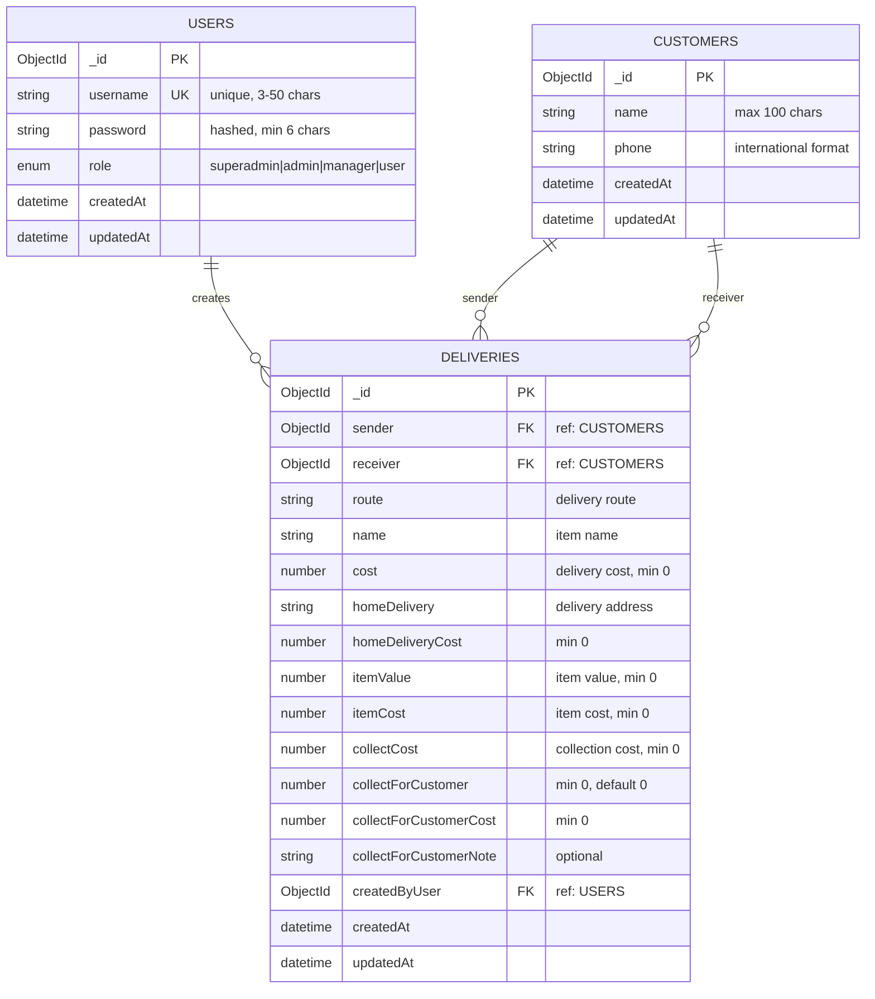

# Database Schema Documentation

This document describes the database schema for the TC Delivery Server project using MongoDB with Mongoose ODM.

## Overview

The database consists of 3 main collections:
- **Users**: Authentication and authorization
- **Customers**: Customer information for delivery services
- **Deliveries**: Delivery orders and transactions

## Entity Relationship Diagram



## Collections Details

### 1. Users Collection

**Purpose**: Manages user authentication and authorization for the delivery system.

#### Schema Fields

| Field | Type | Required | Constraints | Description |
|-------|------|----------|-------------|-------------|
| `_id` | ObjectId | ✅ | Primary Key | Auto-generated MongoDB ObjectId |
| `username` | String | ✅ | Unique, 3-50 chars, alphanumeric + underscore | User login identifier |
| `password` | String | ✅ | Min 6 chars, bcrypt hashed | User password (excluded from queries) |
| `role` | Enum | ✅ | superadmin\|admin\|manager\|user | User permission level |
| `createdAt` | Date | ✅ | Auto-generated | Record creation timestamp |
| `updatedAt` | Date | ✅ | Auto-updated | Record last update timestamp |

#### Role Hierarchy

| Role | Level | Permissions |
|------|-------|-------------|
| `superadmin` | 4 | Can manage all users and data |
| `admin` | 3 | Can manage managers and users |
| `manager` | 2 | Can manage users only |
| `user` | 1 | Basic access only |

#### Indexes
- `username`: Unique index for fast authentication lookup

#### Security Features
- Password hashing using bcrypt with salt rounds = 12
- Password field excluded from queries by default (`select: false`)
- Role-based access control (RBAC)

---

### 2. Customers Collection

**Purpose**: Stores customer information for delivery services (both senders and receivers).

#### Schema Fields

| Field | Type | Required | Constraints | Description |
|-------|------|----------|-------------|-------------|
| `_id` | ObjectId | ✅ | Primary Key | Auto-generated MongoDB ObjectId |
| `name` | String | ✅ | Max 100 chars, trimmed | Customer full name |
| `phone` | String | ✅ | International format (+[1-9][0-14 digits]) | Customer contact number |
| `createdAt` | Date | ✅ | Auto-generated | Record creation timestamp |
| `updatedAt` | Date | ✅ | Auto-updated | Record last update timestamp |

#### Indexes
- `{name: 1, phone: 1}`: Compound unique index to prevent duplicate customers

#### Validation Rules
- Phone number must match international format: `^\+?[1-9]\d{1,14}$`
- Name is trimmed and limited to 100 characters
- Combination of name + phone must be unique

---

### 3. Deliveries Collection

**Purpose**: Manages delivery orders with detailed cost breakdown and customer relationships.

#### Schema Fields

| Field | Type | Required | Constraints | Description |
|-------|------|----------|-------------|-------------|
| `_id` | ObjectId | ✅ | Primary Key | Auto-generated MongoDB ObjectId |
| `sender` | ObjectId | ✅ | References CUSTOMERS | Customer sending the item |
| `receiver` | ObjectId | ✅ | References CUSTOMERS | Customer receiving the item |
| `route` | String | ✅ | Trimmed | Delivery route description |
| `name` | String | ✅ | Trimmed | Name/description of item being delivered |
| `cost` | Number | ✅ | Min 0 | Base delivery cost |
| `homeDelivery` | String | ✅ | Trimmed | Home delivery address |
| `homeDeliveryCost` | Number | ✅ | Min 0 | Additional cost for home delivery |
| `itemValue` | Number | ✅ | Min 0 | Declared value of the item |
| `itemCost` | Number | ✅ | Min 0 | Cost of the item itself |
| `collectCost` | Number | ✅ | Min 0 | Collection/pickup cost |
| `collectForCustomer` | Number | ✅ | Min 0, Default: 0 | Amount to collect for customer (thu dùm) |
| `collectForCustomerCost` | Number | ✅ | Min 0 | Amount to collect from customer |
| `collectForCustomerNote` | String | ❌ | Trimmed | Additional notes for customer collection |
| `createdByUser` | ObjectId | ✅ | References USERS | User who created this delivery |
| `createdAt` | Date | ✅ | Auto-generated | Record creation timestamp |
| `updatedAt` | Date | ✅ | Auto-updated | Record last update timestamp |

#### Cost Breakdown

The delivery system tracks multiple cost components:

1. **Base Cost** (`cost`): Standard delivery fee
2. **Home Delivery Cost** (`homeDeliveryCost`): Additional fee for home delivery
3. **Item Value** (`itemValue`): Declared value for insurance purposes
4. **Item Cost** (`itemCost`): Actual cost of the item
5. **Collect Cost** (`collectCost`): Fee for collection service
6. **Collect For Customer** (`collectForCustomer`): Amount to collect on behalf of customer (thu dùm)
7. **Customer Collection Cost** (`collectForCustomerCost`): Service fee for collecting on behalf of customer

#### Relationships
- **Many-to-One** with CUSTOMERS (sender): One customer can send multiple deliveries
- **Many-to-One** with CUSTOMERS (receiver): One customer can receive multiple deliveries
- **Many-to-One** with USERS (createdByUser): One user can create multiple deliveries

---

## Relationships

### 1. User → Deliveries (1:N)
- **Type**: One-to-Many
- **Foreign Key**: `deliveries.createdByUser` → `users._id`
- **Description**: Each delivery is created by exactly one user, but one user can create multiple deliveries
- **Cascade**: No automatic deletion (deliveries remain for audit purposes)

### 2. Customer → Deliveries as Sender (1:N)
- **Type**: One-to-Many
- **Foreign Key**: `deliveries.sender` → `customers._id`
- **Description**: Each delivery has exactly one sender, but one customer can send multiple deliveries
- **Cascade**: No automatic deletion (preserve delivery history)

### 3. Customer → Deliveries as Receiver (1:N)
- **Type**: One-to-Many
- **Foreign Key**: `deliveries.receiver` → `customers._id`
- **Description**: Each delivery has exactly one receiver, but one customer can receive multiple deliveries
- **Cascade**: No automatic deletion (preserve delivery history)

### 4. Customer Self-Reference (Same Customer as Sender/Receiver)
- **Constraint**: A customer can be both sender and receiver in different deliveries
- **Business Rule**: Same customer can send to themselves (internal transfers)

## Data Integrity Rules

### 1. Referential Integrity
- All ObjectId references must point to existing documents
- Mongoose automatically validates references during population
- No orphaned deliveries (must have valid sender, receiver, and creator)

### 2. Business Rules
- All monetary values must be non-negative
- Phone numbers must follow international format
- Username must be unique across all users
- Customer combination (name + phone) must be unique

### 3. Audit Trail
- All collections include `createdAt` and `updatedAt` timestamps
- Deliveries retain creator information for accountability
- No automatic deletion of historical records

## Indexes Strategy

### Performance Indexes
```javascript
// Users
{ "username": 1 }  // Unique, for authentication

// Customers
{ "name": 1, "phone": 1 }  // Compound unique, prevent duplicates

// Deliveries (Recommended)
{ "sender": 1, "createdAt": -1 }     // Query by sender, recent first
{ "receiver": 1, "createdAt": -1 }   // Query by receiver, recent first
{ "createdByUser": 1, "createdAt": -1 } // Query by creator, recent first
{ "createdAt": -1 }                  // General date-based queries
```

## Sample Data Structure

### User Document
```json
{
  "_id": "ObjectId('...')",
  "username": "admin_user",
  "password": "$2b$12$hashedpassword...",
  "role": "admin",
  "createdAt": "2024-01-15T10:30:00.000Z",
  "updatedAt": "2024-01-15T10:30:00.000Z"
}
```

### Customer Document
```json
{
  "_id": "ObjectId('...')",
  "name": "Nguyen Van A",
  "phone": "+84987654321",
  "createdAt": "2024-01-15T10:30:00.000Z",
  "updatedAt": "2024-01-15T10:30:00.000Z"
}
```

### Delivery Document
```json
{
  "_id": "ObjectId('...')",
  "sender": "ObjectId('customer1_id')",
  "receiver": "ObjectId('customer2_id')",
  "route": "Ho Chi Minh City - Hanoi",
  "name": "Electronics Package",
  "cost": 50000,
  "homeDelivery": "123 Nguyen Trai St, District 1",
  "homeDeliveryCost": 10000,
  "itemValue": 500000,
  "itemCost": 450000,
  "collectCost": 5000,
  "collectForCustomer": 100000,
  "collectForCustomerCost": 100000,
  "collectForCustomerNote": "Collect payment for goods",
  "createdByUser": "ObjectId('user_id')",
  "createdAt": "2024-01-15T10:30:00.000Z",
  "updatedAt": "2024-01-15T10:30:00.000Z"
}
```

## Migration Considerations

### Future Schema Changes
- Use Mongoose schema versioning for major changes
- Add new fields as optional to maintain backward compatibility
- Consider data migration scripts for breaking changes

### Scaling Considerations
- Consider sharding by date for large delivery volumes
- Implement archiving strategy for old deliveries
- Monitor index performance as data grows

## Security Considerations

1. **Data Protection**
   - Passwords are hashed and never stored in plain text
   - Sensitive fields excluded from API responses
   - Input validation on all user-provided data

2. **Access Control**
   - Role-based permissions for data access
   - User actions tracked via `createdByUser` field
   - Audit trail maintained for all operations

3. **Data Validation**
   - Schema-level validation for all required fields
   - Format validation for phone numbers and usernames
   - Business rule validation in application layer