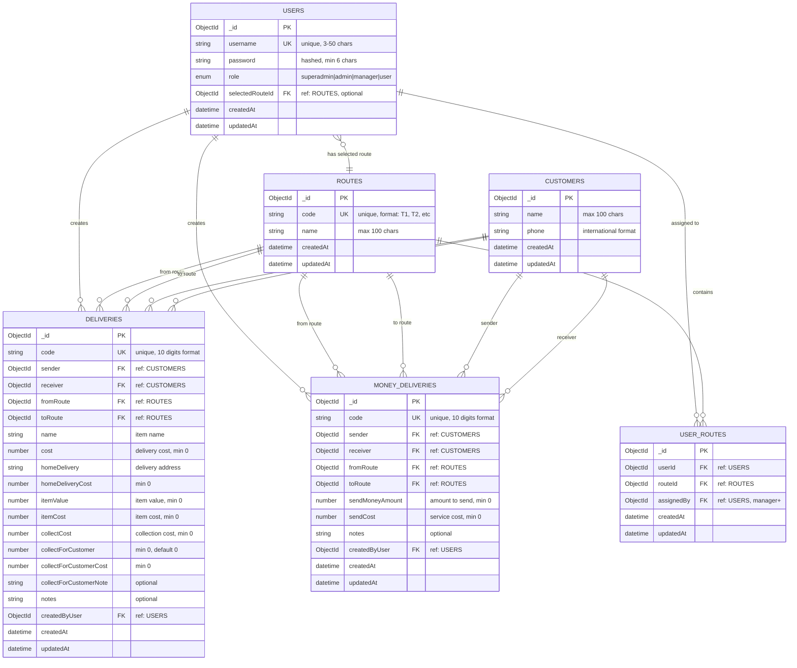

# Entity Relationship Diagram

## TC Delivery Server Database Schema

```mermaid
erDiagram
    USERS ||--o{ DELIVERIES : creates
    USERS ||--o{ MONEY_DELIVERIES : creates
    USERS ||--o{ USER_ROUTES : "assigned to"
    USERS }o--|| ROUTES : "has selected route"
    ROUTES ||--o{ USER_ROUTES : "contains"
    ROUTES ||--o{ DELIVERIES : "from route"
    ROUTES ||--o{ DELIVERIES : "to route"
    ROUTES ||--o{ MONEY_DELIVERIES : "from route"
    ROUTES ||--o{ MONEY_DELIVERIES : "to route"
    CUSTOMERS ||--o{ DELIVERIES : "sender"
    CUSTOMERS ||--o{ DELIVERIES : "receiver"
    CUSTOMERS ||--o{ MONEY_DELIVERIES : "sender"
    CUSTOMERS ||--o{ MONEY_DELIVERIES : "receiver"

    USERS {
        ObjectId _id PK
        string username UK "unique, 3-50 chars"
        string password "hashed, min 6 chars"
        enum role "superadmin|admin|manager|user"
        ObjectId selectedRouteId FK "ref: ROUTES, optional"
        datetime createdAt
        datetime updatedAt
    }

    ROUTES {
        ObjectId _id PK
        string code UK "unique, format: T1, T2, etc"
        string name "max 100 chars"
        datetime createdAt
        datetime updatedAt
    }

    USER_ROUTES {
        ObjectId _id PK
        ObjectId userId FK "ref: USERS"
        ObjectId routeId FK "ref: ROUTES"
        ObjectId assignedBy FK "ref: USERS, manager+"
        datetime createdAt
        datetime updatedAt
    }

    CUSTOMERS {
        ObjectId _id PK
        string name "max 100 chars"
        string phone "international format"
        datetime createdAt
        datetime updatedAt
    }

    DELIVERIES {
        ObjectId _id PK
        string code UK "unique, 10 digits format"
        ObjectId sender FK "ref: CUSTOMERS"
        ObjectId receiver FK "ref: CUSTOMERS"
        ObjectId fromRoute FK "ref: ROUTES"
        ObjectId toRoute FK "ref: ROUTES"
        string name "item name"
        number cost "delivery cost, min 0"
        string homeDelivery "delivery address"
        number homeDeliveryCost "min 0"
        number itemValue "item value, min 0"
        number itemCost "item cost, min 0"
        number collectCost "collection cost, min 0"
        number collectForCustomer "min 0, default 0"
        number collectForCustomerCost "min 0"
        string collectForCustomerNote "optional"
        string notes "optional"
        ObjectId createdByUser FK "ref: USERS"
        datetime createdAt
        datetime updatedAt
    }

    MONEY_DELIVERIES {
        ObjectId _id PK
        string code UK "unique, 10 digits format"
        ObjectId sender FK "ref: CUSTOMERS"
        ObjectId receiver FK "ref: CUSTOMERS"
        ObjectId fromRoute FK "ref: ROUTES"
        ObjectId toRoute FK "ref: ROUTES"
        number sendMoneyAmount "amount to send, min 0"
        number sendCost "service cost, min 0"
        string notes "optional"
        ObjectId createdByUser FK "ref: USERS"
        datetime createdAt
        datetime updatedAt
    }
```