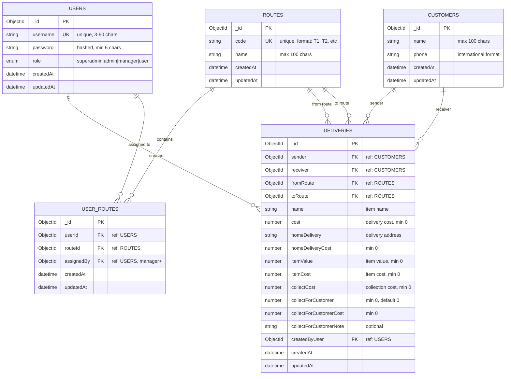

# Entity Relationship Diagram

## TC Delivery Server Database Schema

## Quick Reference

### Relationships
- **1 User** → **Many Deliveries** (creates)
- **1 Customer** → **Many Deliveries** (as sender)
- **1 Customer** → **Many Deliveries** (as receiver)
- **1 Route** → **Many Deliveries** (as from route)
- **1 Route** → **Many Deliveries** (as to route)
- **Many Users** ↔ **Many Routes** (through USER_ROUTES junction table)
- **1 User** → **Many User-Route Assignments** (assigned by manager+)

### Key Constraints
- Users: `username` is unique
- Routes: `code` is unique (format: T1, T2, etc.)
- Customers: `(name + phone)` combination is unique
- User_Routes: `(userId + routeId)` combination is unique
- Deliveries: All foreign keys are required (sender, receiver, fromRoute, toRoute, createdByUser)

### Business Rules
- Only users with role `manager`, `admin`, or `superadmin` can assign routes to users
- Users with role `user` can only view routes they are assigned to
- Route assignments are tracked with `assignedBy` field for audit purposes

### Legend
- **PK**: Primary Key
- **FK**: Foreign Key
- **UK**: Unique Key