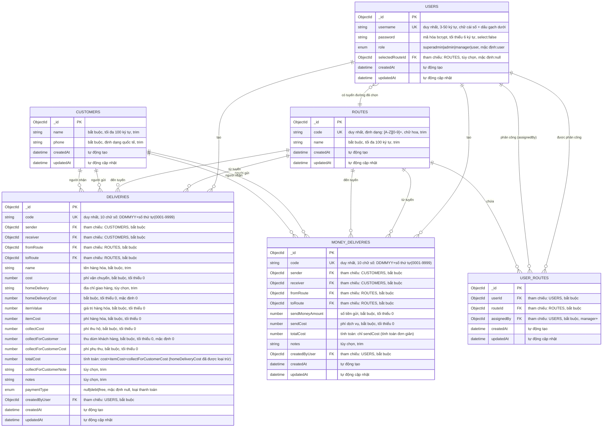

# Sơ Đồ Mối Quan Hệ Thực Thể

## Sơ Đồ Cơ Sở Dữ Liệu TC Delivery Server

## Chi Tiết Sơ Đồ và Quy Tắc Nghiệp Vụ

### Tên Các Collection
- `users` - Tài khoản người dùng và xác thực
- `customers` - Cơ sở dữ liệu thông tin khách hàng
- `routes` - Cấu hình tuyến đường vận chuyển
- `userRoutes` - Mối quan hệ nhiều-nhiều giữa người dùng và tuyến đường
- `deliveries` - Giao dịch vận chuyển thông thường
- `moneydeliveries` - Giao dịch chuyển tiền

### Ràng Buộc và Xác Thực Chính

#### Bảng USERS
- **Tên đăng nhập**: Phải duy nhất, 3-50 ký tự, chỉ chữ cái số và dấu gạch dưới
- **Mật khẩu**: Tối thiểu 6 ký tự, mã hóa bằng bcrypt (salt rounds: 12)
- **Phân cấp vai trò**: user(1) → manager(2) → admin(3) → superadmin(4)
- **Tuyến đường đã chọn**: Tham chiếu tùy chọn đến tuyến đường ưa thích của người dùng

#### Bảng CUSTOMERS
- **Ràng buộc duy nhất**: Tổ hợp name + phone phải duy nhất
- **Định dạng số điện thoại**: Định dạng quốc tế với regex `/^\+?[1-9]\d{1,14}$/`
- **Index hiệu suất**: Text search trên name, exact match trên phone
- **Index quan trọng**: `{phone: 1}` cho phone search, `{name: "text"}` cho text search

#### Bảng ROUTES
- **Định dạng mã**: Phải khớp với pattern `[A-Z]\d+` (ví dụ: T1, T2, A1)
- **Tự động chuyển đổi**: Mã được tự động chuyển thành chữ hoa

#### Bảng USER_ROUTES
- **Ràng buộc duy nhất**: Mỗi người dùng chỉ có thể được phân công vào một tuyến đường một lần (userId + routeId)
- **Quyền phân công**: Chỉ có manager trở lên mới có thể phân công tuyến đường
- **Index hiệu suất**: Index riêng biệt trên userId và routeId để tối ưu truy vấn

#### Bảng DELIVERIES
- **Định dạng mã**: Định dạng 10 số DDMMYY + số thứ tự (0001-9999)
- **Quy tắc nghiệp vụ**:
  - Người gửi và người nhận không thể là cùng một khách hàng
  - Tuyến đi và tuyến đến không thể giống nhau
  - Tổng chi phí được tính tự động qua middleware
- **Tính toán chi phí**: `totalCost = cost + itemCost + collectForCustomerCost` (homeDeliveryCost đã được loại trừ)
- **Loại thanh toán**: 
  - `null` (mặc định): Thanh toán bình thường, khách hàng thanh toán đầy đủ
  - `debt`: Khách hàng nợ tiền, sẽ thanh toán sau
  - `free`: Giao hàng miễn phí, không cần thanh toán
- **Index hiệu suất**: Được tối ưu cho 10M+ records với compound indexes
- **Index quan trọng**: 
  - `{sender: 1, receiver: 1, toRoute: 1}` - Index chính cho frequent customers
  - `{receiver: 1, toRoute: 1}` - Index hỗ trợ cho receiver lookups
  - `{code: 1, fromRoute: 1, toRoute: 1}` - Index cho code + route lookup

#### Bảng MONEY_DELIVERIES
- **Định dạng mã**: Cùng định dạng 10 chữ số như deliveries
- **Quy tắc nghiệp vụ**: Cùng các ràng buộc người gửi/nhận và tuyến đường như deliveries
- **Chi phí đơn giản**: `totalCost = sendCost` (loại trừ sendMoneyAmount khỏi tổng)
- **Index hiệu suất**: Cùng pattern tối ưu như deliveries

### Tối Ưu Hóa Hiệu Suất

#### Chiến Lược Index Database
1. **Khóa Chính**: ObjectId indexes trên tất cả các trường `_id`
2. **Index Duy Nhất**: Trên các trường code cho deliveries và money deliveries
3. **Index Khóa Ngoại**: Trên tất cả các trường tham chiếu để tối ưu join performance
4. **Index Hỗn Hợp**: Cho các pattern query phổ biến
   - `{fromRoute: 1, toRoute: 1, createdAt: -1}` - Phân tích tuyến đường
   - `{sender: 1, createdAt: -1}` - Lịch sử khách hàng gửi
   - `{userId: 1, routeId: 1}` - Phân công tuyến đường cho user
5. **Index Hiệu Suất Quan Trọng**: Cho tối ưu frequent customers (40-60% faster)
   - `{sender: 1, receiver: 1, toRoute: 1}` - Index chính cho frequent customers aggregation
   - `{receiver: 1, toRoute: 1}` - Index hỗ trợ cho receiver lookups
   - `{phone: 1}` - Index cho exact phone search trong customers
   - `{name: "text"}` - Text search index cho tìm kiếm tên khách hàng

#### Tính Năng Tối Ưu Truy Vấn
- **Lean Queries**: Cho các thao tác chỉ đọc để giảm sử dụng bộ nhớ
- **Field Projection**: Giới hạn các trường trả về để giảm truyền tải mạng
- **Text Search**: Khả năng tìm kiếm toàn văn trên tên khách hàng
- **Date Sorting**: Tối ưu các truy vấn gần nhất trước với descending createdAt indexes

### Quy Tắc Chuyển Đổi Dữ Liệu

#### Định Dạng Phản Hồi
- Tất cả trường `_id` của MongoDB được chuyển thành `id` trong API responses
- Trường password được loại trừ khỏi tất cả responses (`select: false`)
- Trường `__v` version được xóa khỏi JSON output
- Trường date duy trì định dạng ISO string trong responses

#### Xử Lý Middleware
- **Pre-save**: Tính toán chi phí tự động và xác thực quy tắc nghiệp vụ
- **Pre-update**: Duy trì tính toán chi phí trong quá trình cập nhật
- **Password Hashing**: Mã hóa bcrypt tự động khi thay đổi mật khẩu

### Ghi Chú Tích Hợp API

#### Luồng Xác Thực
- JWT tokens chứa: `userId`, `username`, `role`
- Thời gian hết hạn token có thể cấu hình qua biến môi trường `JWT_EXPIRES_IN`
- Kiểm soát truy cập dựa trên vai trò được thực thi ở mức middleware

#### Tạo Mã
- **Endpoint Mã Tiếp Theo**: `GET /api/delivery/next-code?toRouteId={ObjectId}`
- **Mã Chuyển Tiền**: `GET /api/money-deliveries/next-code?toRouteId={ObjectId}`
- Chuỗi mã được quản lý theo từng tuyến để tránh xung đột

### Cập Nhật Gần Đây Quan Trọng

#### Phiên Bản Mới Nhất
- **Field PaymentType**: Thêm trường `paymentType` vào bảng DELIVERIES với 3 giá trị:
  - `null` (mặc định): Thanh toán bình thường
  - `debt`: Thanh toán nợ (khách hàng sẽ trả sau)  
  - `free`: Giao hàng miễn phí
- **Cập Nhật Công Thức TotalCost**: Loại bỏ `homeDeliveryCost` khỏi tính toán tổng chi phí
  - Công thức cũ: `totalCost = cost + homeDeliveryCost + itemCost + collectForCustomerCost`
  - Công thức mới: `totalCost = cost + itemCost + collectForCustomerCost`

### Cân Nhắc Migration và Mở Rộng

#### Mục Tiêu Quy Mô Hiện Tại
- Thiết kế cho 10M+ bản ghi delivery
- Tối ưu các pattern truy vấn cho các thao tác quy mô lớn
- Pipeline aggregation hiệu quả bộ nhớ cho báo cáo

#### Cải Tiến Tương Lai
- Chuẩn bị cho mở rộng ngang với indexing phù hợp
- Thiết kế stateless cho phép cân bằng tải
- Chiến lược caching sẵn sàng để triển khai ở lớp dịch vụ