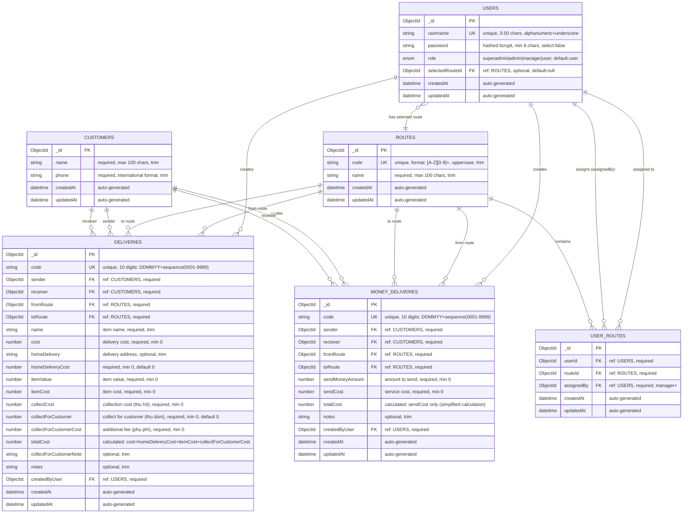

# Entity Relationship Diagram

## TC Delivery Server Database Schema

## Schema Details and Business Rules

### Collection Names
- `users` - User accounts and authentication
- `customers` - Customer information database
- `routes` - Delivery routes configuration
- `userRoutes` - Many-to-many relationship between users and routes
- `deliveries` - Regular delivery transactions
- `moneydeliveries` - Money transfer transactions

### Key Constraints and Validations

#### USERS Table
- **Username**: Must be unique, 3-50 characters, alphanumeric + underscore only
- **Password**: Minimum 6 characters, hashed with bcrypt (salt rounds: 12)
- **Role Hierarchy**: user(1) → manager(2) → admin(3) → superadmin(4)
- **Selected Route**: Optional reference to user's preferred route

#### CUSTOMERS Table
- **Unique Constraint**: Combination of name + phone must be unique
- **Phone Format**: International format validation with regex `/^\+?[1-9]\d{1,14}$/`
- **Performance Indexes**: Text search on name, exact match on phone

#### ROUTES Table
- **Code Format**: Must match pattern `[A-Z]\d+` (e.g., T1, T2, A1)
- **Auto-transformation**: Code is automatically converted to uppercase

#### USER_ROUTES Table
- **Unique Constraint**: Each user can only be assigned to a route once (userId + routeId)
- **Assignment Permission**: Only managers and above can assign routes
- **Performance Indexes**: Separate indexes on userId and routeId for query optimization

#### DELIVERIES Table
- **Code Format**: 10-digit format DDMMYY + sequence number (0001-9999)
- **Business Rules**:
  - Sender and receiver cannot be the same customer
  - From route and to route cannot be the same
  - Total cost automatically calculated via middleware
- **Cost Calculation**: `totalCost = cost + homeDeliveryCost + itemCost + collectForCustomerCost`
- **Performance Indexes**: Optimized for 10M+ records with compound indexes

#### MONEY_DELIVERIES Table
- **Code Format**: Same 10-digit format as deliveries
- **Business Rules**: Same sender/receiver and route restrictions as deliveries
- **Simplified Cost**: `totalCost = sendCost` (excludes sendMoneyAmount from total)
- **Performance Indexes**: Same optimization pattern as deliveries

### Performance Optimizations

#### Database Indexes Strategy
1. **Primary Keys**: ObjectId indexes on all `_id` fields
2. **Unique Indexes**: On code fields for deliveries and money deliveries
3. **Foreign Key Indexes**: On all reference fields for join performance
4. **Compound Indexes**: For common query patterns
   - `{fromRoute: 1, toRoute: 1, createdAt: -1}` - Route analysis
   - `{sender: 1, createdAt: -1}` - Customer history
   - `{userId: 1, routeId: 1}` - User route assignments

#### Query Optimization Features
- **Lean Queries**: For read-only operations to reduce memory usage
- **Field Projection**: Limit returned fields to reduce network transfer
- **Text Search**: Full-text search capability on customer names
- **Date Sorting**: Optimized recent-first queries with descending createdAt indexes

### Data Transformation Rules

#### Response Formatting
- All MongoDB `_id` fields are transformed to `id` in API responses
- Password fields are excluded from all responses (`select: false`)
- `__v` version fields are removed from JSON output
- Date fields maintain ISO string format in responses

#### Middleware Processing
- **Pre-save**: Automatic cost calculations and business rule validation
- **Pre-update**: Maintains cost calculations during updates
- **Password Hashing**: Automatic bcrypt hashing on password changes

### API Integration Notes

#### Authentication Flow
- JWT tokens contain: `userId`, `username`, `role`
- Token expiration configurable via `JWT_EXPIRES_IN` environment variable
- Role-based access control enforced at middleware level

#### Code Generation
- **Next Code Endpoint**: `GET /api/delivery/next-code?toRouteId={ObjectId}`
- **Money Delivery Codes**: `GET /api/money-deliveries/next-code?toRouteId={ObjectId}`
- Code sequences managed per route to avoid conflicts

### Migration and Scaling Considerations

#### Current Scale Targets
- Designed for 10M+ delivery records
- Optimized query patterns for high-volume operations
- Memory-efficient aggregation pipelines for reporting

#### Future Enhancements
- Prepared for horizontal scaling with proper indexing
- Stateless design enables load balancing
- Caching strategy ready for implementation at service layer