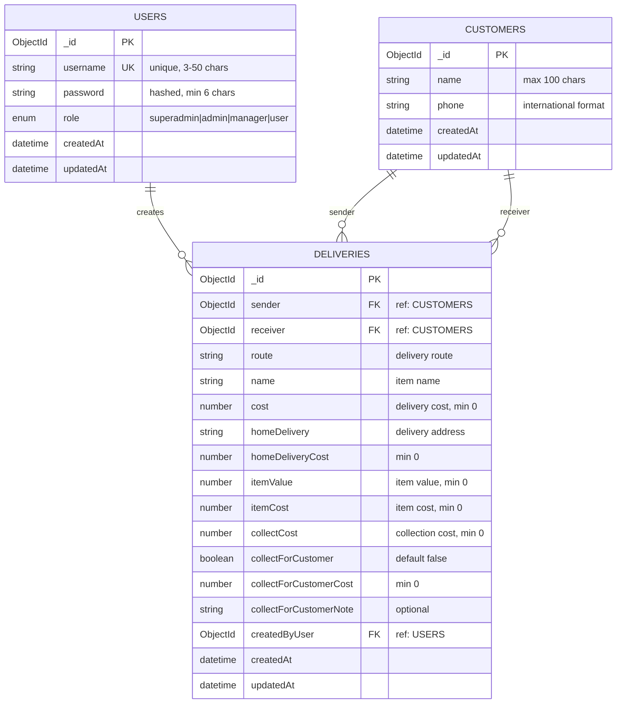

# Entity Relationship Diagram

## TC Delivery Server Database Schema

## Quick Reference

### Relationships
- **1 User** → **Many Deliveries** (creates)
- **1 Customer** → **Many Deliveries** (as sender)
- **1 Customer** → **Many Deliveries** (as receiver)

### Key Constraints
- Users: `username` is unique
- Customers: `(name + phone)` combination is unique
- Deliveries: All foreign keys are required

### Legend
- **PK**: Primary Key
- **FK**: Foreign Key
- **UK**: Unique Key